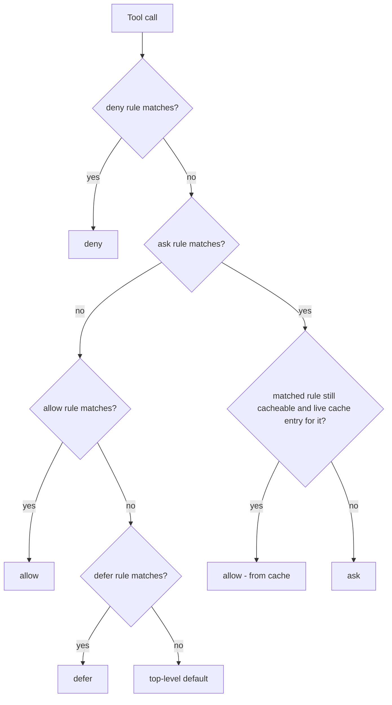
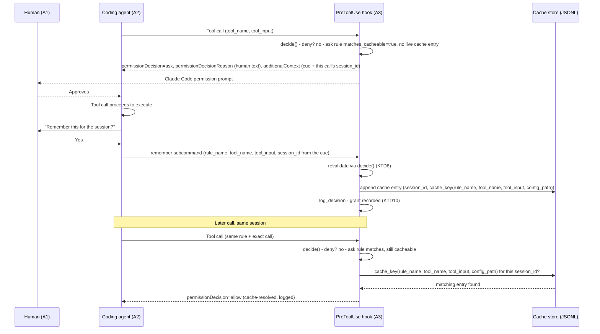

# Yapermission Cacheable Ask Rules - Plan

## Goal Capsule

- **Objective:** Within one Claude Code session, an `[[ask]]` rule you've opted into caching stops re-prompting once you've told the agent to remember your approval, without weakening what a `[[deny]]` rule can block.
- **Means:** A per-rule opt-in cache flag, a new confirm-first yapermission skill that writes cache entries, and a session-scoped lookup keyed on the matched rule plus the exact tool call.
- **Product authority:** This Product Contract — no upstream `STRATEGY.md`/`PRODUCT.md` governs `plugins/yapermission`.
- **Open blockers:** None. All product decisions were resolved during brainstorming, and the one technical grounding item (how the hook identifies "the current session") was confirmed against Claude Code's hooks reference.

---

## Product Contract

### Summary

Adds an opt-in caching layer to yapermission's `[[ask]]` rules. A new TOML flag marks a rule cacheable; a new skill lets you remember one approved decision for the rest of the session so the same call stops re-prompting. The agent always confirms with you before caching, and a `[[deny]]` rule always overrides a cached entry.

### Problem Frame

yapermission's `[[ask]]` rules force Claude Code's permission prompt on every matching call, with no notion of "I already approved this in this session" — unlike Claude Code's own native permission memory, which a hook-forced `ask` decision bypasses. For a rule you trust but haven't (or won't) promote to a permanent `[[allow]]` entry, this means re-approving the same command repeatedly within one working session.

### Requirements

**Rule configuration**
- R1. An `[[ask]]` rule can be marked cacheable via a new opt-in field, default off, so existing configs keep prompting on every match unless the rule author explicitly opts in.

**Session cache**
- R2. When a cacheable rule's decision is approved, the caching skill can create a cache entry scoped to the current session, keyed by the rule that matched and the exact tool call (tool name plus input) that was approved.
- R3. Within that session, a call that matches both the same rule and the same exact tool call as a live cache entry resolves to `allow` without prompting.
- R4. A cache entry never suppresses a `[[deny]]` rule — a `[[deny]]` match always overrides a cached allow for that call.
- R5. Cache entries are scoped to the session that created them and do not apply in a different session.

**Agent behavior**
- R6. When a cacheable rule's `ask` decision fires and is approved, the agent-facing cue communicates that the rule is cacheable, so the invoking agent knows caching is available to offer.
- R7. The agent invokes the caching skill only after explicitly asking the user and receiving confirmation — never silently.

**Auditability**
- R8. A decision resolved from the cache is still written to yapermission's audit log, distinguishable from a decision resolved by direct rule evaluation.

### Key Decisions

- **Cache key is rule + exact command, not whole-rule-only or command-only.** Narrows relief to the same rule matching the same call, rather than blanket-allowing every future match of the rule. (session-settled: user-directed — chosen over exact-command-only and whole-rule-only: explicitly asked to combine both signals) Governs R2, R3.
- **Confirm-first, never silent.** The agent always checks with you before caching a decision, so the auto-allow surface never expands without an explicit human step. (session-settled: user-directed — chosen over silent auto-cache: no unnoticed permission expansion) Governs R7.
- **Session-scoped only for v1; time-duration (TTL) caching deferred.** The smaller version already relieves the repeated-prompt pain described in dialogue. (session-settled: user-directed — chosen over shipping session + TTL together: smallest version that delivers the value) Governs R2, R3, R5.
- **Cacheability is opt-in per rule, default off.** Existing `[[ask]]` rules keep prompting every time unless explicitly marked cacheable, matching the plugin's existing fail-safe posture (config absence or errors already fall back to `ask`). (session-settled: user-approved — chosen over cacheable-by-default: proposed with the tradeoff surfaced, accepted) Governs R1.
- **Deny always overrides a cached allow.** Matches yapermission's existing evaluation order, where more restrictive intent wins (deny beats ask beats allow beats defer); a cache entry resolves at the `allow` tier and never beats a `[[deny]]` rule, including one added after the cache entry was created. (session-settled: user-approved — chosen over letting a cache entry stand regardless of later deny rules: proposed with the tradeoff surfaced, accepted) Governs R4.

Updated evaluation order with the cache check inserted:

The cache check runs against the *matched* `ask` rule, not as an independent branch before `ask` — a rule that's been edited to remove `cacheable`, tightened, or deleted no longer produces a cache hit even if an old entry exists (see Planning Contract KTD5).

### Actors

- A1. The developer — approves or denies tool calls via Claude Code's permission prompt, and confirms whether to cache a decision when the agent asks.
- A2. The coding agent (e.g. Claude Code) — reads the cacheable cue on an `ask` decision, offers to remember an approved decision, and invokes the caching skill only on confirmation.
- A3. The yapermission `PreToolUse` hook — evaluates deny, then ask (checking a matched cacheable rule against the live cache), then allow, then defer, and logs the resolved decision.

### Key Flows

- F1. First approval of a cacheable rule
  - **Trigger:** A cacheable `[[ask]]` rule matches a tool call and the user approves Claude Code's permission prompt.
  - **Actors:** A1, A2, A3
  - **Steps:** Hook returns `ask` with a cacheable cue; Claude Code prompts the user; user approves; agent notices the cacheable cue and asks whether to remember the decision for the session; on yes, agent invokes the caching skill with the matched rule and exact call; skill writes a session-scoped cache entry.
  - **Covers:** R2, R6, R7

- F2. Cached call replay
  - **Trigger:** A later tool call in the same session matches both the rule and exact call of a live cache entry.
  - **Actors:** A3
  - **Steps:** The hook matches the `ask` rule, finds it still cacheable, and checks the session cache for that rule and exact call; on a match it returns `allow` instead of `ask`; the decision is logged as cache-resolved.
  - **Covers:** R3, R8

- F3. Deny overrides a stale cache entry
  - **Trigger:** A call matches both a live cache entry and a `[[deny]]` rule (for example, the TOML was tightened after the cache entry was created).
  - **Actors:** A3
  - **Steps:** The hook evaluates `[[deny]]` rules first, per existing precedence; deny wins regardless of any matching cache entry.
  - **Covers:** R4

### Acceptance Examples

- AE1. **Covers R1, R6, R7.** Given an `[[ask]]` rule marked cacheable, when it fires and the user approves, then the agent offers to remember the decision for the session and invokes the caching skill only if the user says yes.
- AE2. **Covers R2, R3, R8.** Given a live session cache entry for a rule and exact command, when the same rule matches the same exact command again in the same session, then the hook returns `allow` without prompting and logs the decision as cache-resolved.
- AE3. **Covers R1.** Given an `[[ask]]` rule with no cacheable flag set, when it fires and is approved, then no cache entry is offered or created — behavior is unchanged from today.
- AE4. **Covers R4.** Given a live cache entry for a call, when a `[[deny]]` rule also matches that same call, then the decision is `deny`, not `allow`.
- AE5. **Covers R5.** Given a cache entry created in session S1, when the same rule and exact command occur in a different session S2, then the call is evaluated normally with no cache hit.

### Scope Boundaries

**Deferred for later**
- Time-duration (TTL) scoped caching, independent of session lifetime.
- Broader cache keys — whole-rule-only or fuzzy/pattern-based matching — beyond rule plus exact command.
- Introspecting or revoking active cache entries mid-session (for example, a "show/clear my grants" command).

**Outside this feature's scope**
- Silent or automatic caching without a confirm step — explicitly rejected in favor of confirm-first.
- Caching `allow` or `deny` decisions purely for evaluation-speed reasons — this feature targets reducing repeat prompts, not memoizing rule evaluation.

### Dependencies / Assumptions

- Confirmed: the `PreToolUse` hook's stdin JSON payload carries a `session_id` field (Claude Code's [hooks reference](https://code.claude.com/docs/en/hooks), "Common input fields") — the sole, documented source; no session-identifying environment variable exists. `session_id` stays stable across a plain resume, but `/branch`, `--fork-session`, or `/clear` mint a fresh one, which is consistent with — not a gap in — scoping cache entries to "the current session" (R5).
- Assumption: an approved `ask` decision is observable to the invoking agent because its own tool call proceeds to execute. This is what lets the agent (rather than a new `PostToolUse` hook) notice the approval and decide whether to offer caching.
- Dependency: builds on yapermission's existing rule-evaluation engine (`plugins/yapermission/scripts/yapermission.py`) and TOML schema (`plugins/yapermission/skills/yap-rule-syntax/references/schema.md`), which planning extends with the cacheable flag, the cache store, and the new skill.

---

## Planning Contract

Product Contract preservation: no R/A/F/AE/Key Decision text was edited beyond the flowchart under Key Decisions, corrected to match KTD5 below (the "deny beats cache" decision it illustrates is unchanged; only the mechanism drawn was wrong). The Product Contract's "Outstanding Questions — Deferred to Planning" section was removed because all four items are now resolved below (KTD1-KTD10) — this is the resolution the brainstorm's "Deferred to Planning" label anticipated, not a scope change.

### Key Technical Decisions

- KTD1. **Cacheable cue travels via `additionalContext`, not `permissionDecisionReason`.** Claude Code's hooks reference documents `permissionDecisionReason` as shown to the human only, and `additionalContext` as added to Claude's own context — the field an agent-facing cue actually needs. Phrase the cue conditionally ("if this call proceeds to execute, the rule is cacheable") so it stays correct whether `additionalContext` is delivered before or after the human's approve/deny choice. Governs R6.
- KTD2. **Session scoping uses the `PreToolUse` hook's `session_id` stdin field, not an environment variable.** It is the only field Claude Code's hooks reference documents for this purpose. A sibling plugin (`plugins/a2a/scripts/a2a-helper.py:93`) reads a `CLAUDE_SESSION_ID` env var with a `"default"` fallback; that variable is not part of the documented hook contract, and the fallback risks bleeding one session's cache into another's. Governs R2, R3, R5.
- KTD3. **Cache store is one shared append-only JSONL file, `0o600`, no cleanup in v1.** Mirrors `log_decision()`'s existing rationale (tool inputs can carry secrets) and no-rotation posture. Each record carries its own `session_id`, matching the log's "one file, record carries context" shape rather than a2a's per-session-hashed-filename approach. Lives under the OS temp directory (`tempfile.gettempdir()`), not the home directory — unlike the audit log, the cache is explicitly ephemeral, and the OS's own temp-file lifecycle is the cleanup this feature deliberately doesn't build itself. Governs R2, R3, R5.
- KTD4. **`decide()` stays a pure function; the cache-check receives loaded entries as a parameter.** Preserves the existing dependency-free unit-test shape (`TestDecide` calls `decide()` directly with no I/O) and keeps AE2/AE4/AE5 testable without touching the filesystem. Governs R3, R4.
- KTD5. **The cache check runs against the matched `ask` rule, after the `ask` group evaluates — not as an independent step between `deny` and `ask`.** `cache_key` needs a `rule_name`, which does not exist until an `ask` rule has actually matched, so a cache check placed *before* `ask` cannot work. Evaluating `ask` first, then checking whether the matched rule is still `cacheable = true` and has a live cache entry, fixes that and is strictly stronger than the original design: a rule that's later edited to remove `cacheable`, tightened, or deleted no longer produces a cache hit, with no separate revocation mechanism needed. `[[deny]]` rules still run before `ask`, so a `[[deny]]` rule always beats a cached allow either way. (session-settled: user-approved — chosen over letting a cache entry stand regardless of later deny rules: proposed with the tradeoff surfaced, accepted) Governs R4.
- KTD6. **The `remember` subcommand revalidates before writing.** It re-derives the decision for the exact `(tool_name, tool_input)` it is handed via `decide()` and refuses to write unless that resolves to an `ask` match on the claimed rule with `cacheable = true`. Without this, an agent could persist a broader or different call than the one actually approved. This proves the call *would* legitimately resolve to a cacheable match; it does not, and cannot, prove the human actually saw and approved this specific instance before `remember` ran — see the Risks entry below. Governs R2, R7.
- KTD7. **`cache_key` is a SHA-256 hash over the JSON-serialized `(rule_name, tool_name, tool_input, config_path)` quadruple with sorted keys, not string concatenation.** The key is the read-path check that decides whether a call is auto-allowed, so an ambiguous encoding is a bypass vector — naive concatenation could let a crafted `tool_input` value collide with a different rule's or tool's key. Canonical JSON serialization (`sort_keys=True`) with the fields kept structurally distinct avoids that. `config_path` (the resolved config file yapermission is evaluating against, per the engine's existing cwd-based resolution) is included because config resolution is per-cwd, not per-session — without it, a cache entry created under one project's config could produce a false hit under a different project's same-named cacheable rule within the same session. Governs R2, R3.
- KTD8. **The cache file is opened with `O_NOFOLLOW` and its owning uid is checked against the current user before use, on both the read path and the write path.** `CACHE_PATH` is a fixed name in the OS temp directory (KTD3), which is world-writable; without this, a local attacker could pre-create the path with a permissive mode or a symlink before yapermission ever writes it, since `O_CREAT` alone follows symlinks — and a hardened write path alone would still let `load_cache` transparently follow a pre-created symlink on every read, bypassing the `ask` prompt entirely rather than just polluting the cache. This does not fully close every local-tampering vector — see the Risks entry below — but it closes the cheap ones at negligible cost. Governs R2, R3, R5.
- KTD9. **`remember` receives `session_id` as an explicit argument sourced from the hook's own `additionalContext` cue, not from an environment variable.** `remember` runs as a plain CLI subcommand with no access to the `PreToolUse` stdin event, so it has no independent way to know "the current session" the way `cmd_hook` does. The hook already knows its own `session_id` when it emits the cacheable cue (KTD1); embedding it in that cue text and having the agent pass it straight through to `remember` keeps the value hook-sourced rather than falling back to the `CLAUDE_SESSION_ID` environment variable KTD2 already rejected for the read path. Governs R2, R5.
- KTD10. **`remember` calls `log_decision` on both a successful write and a revalidation refusal.** Creating a cache entry converts future `ask` prompts into silent allows for the rest of the session — the single most security-relevant event this feature adds — so it needs its own audit trail entry distinct from the cache-resolved replays R8 already covers. Governs R7, R8.

### Assumptions

- `additionalContext` reaches Claude's context for a `PreToolUse` `ask` decision; Claude Code's hooks reference confirms the field exists and is model-only but does not state whether it is attached before or after the human's approve/deny choice. KTD1's conditional phrasing is the mitigation; the Verification Contract's live-session check confirms the actual behavior before U1-U3's cache infrastructure is treated as load-bearing.
- `session_id` is stable for the lifetime of one plain Claude Code session and changes on `/branch`, `--fork-session`, or `/clear` (confirmed against Claude Code's [hooks reference](https://code.claude.com/docs/en/hooks) and [sessions guide](https://code.claude.com/docs/en/sessions)), which is the scoping behavior R5 wants.
- This plan targets a single-user development machine. The cache file's `O_NOFOLLOW` and owner-uid check (KTD8) rule out the cheap local-tampering vectors but do not make the cache safe on a machine shared with an untrusted local user.

### Risks

- **Confirm-first is a prompt-level convention, not a technically enforced proof of approval.** KTD6's revalidation proves a claimed call would legitimately resolve to a cacheable `ask` match; it cannot prove the human actually saw and approved that specific call before `remember` ran. A misbehaving or compromised agent could invoke `remember` for a call the human never saw prompted, and from then on that call is silently allowed for the rest of the session — a real escalation over the rest of yapermission's trust model, where an agent's dishonesty about a single `ask` decision risks only that one action, still gated by Claude Code's own prompt. This is the architecture the brainstorm chose (an agent-mediated skill, not a `PostToolUse` hook that would observe approval directly) and is accepted as this feature's scope, not fixed here.
- **The cache file's fixed path in the OS temp directory (KTD3) is a residual local-tampering surface even with KTD8's hardening.** `O_NOFOLLOW` and an owner-uid check close the cheap pre-creation and symlink vectors, but this plan does not attempt full protection against an untrusted local user on a shared machine — see the single-user-machine assumption above.

### Sources / Research

- Claude Code hooks reference, `PreToolUse` `hookSpecificOutput` fields — confirms `permissionDecisionReason` is human-only and `additionalContext` is model-only (KTD1), and confirms `session_id` as the documented session identifier with no env-var equivalent (KTD2). https://code.claude.com/docs/en/hooks
- `plugins/yapermission/scripts/yapermission.py:104-113` (`_RULE_GROUPS`, `decide()`) — existing precedence chain and its "every group beats every group below it" invariant (KTD5).
- `plugins/yapermission/scripts/yapermission.py:158-177` (`log_decision()`) — existing audit-log pattern: `os.open` with `0o600`, fail-open on `OSError` (KTD3).
- `plugins/yapermission/tests/test_yapermission.py:255-291` (`TestActiveConfigPath`) — existing tmpdir-and-monkeypatched-module-constant test pattern to follow for cache-store tests.
- `plugins/a2a/scripts/a2a-helper.py:92-109` (`_session_path`, `_load_session`, `_save_session`) — the repo's only prior session-scoped-file precedent; informed KTD2's and KTD3's departures (documented `session_id` over env var; shared file over per-session filename hash) and what to keep (temp-dir location, fail-open on parse error).
- `plugins/yapermission/skills/yap-onboard/SKILL.md`, `plugins/yapermission/skills/yap-explain/SKILL.md` — frontmatter shape (`name: yap:<short-name>`, trigger-phrase `description`, scoped `allowed-tools`) and script-invocation convention (`python3 ${CLAUDE_PLUGIN_ROOT}/scripts/yapermission.py <subcommand> ...`) followed by U4's new skill.

### High-Level Technical Design

---

## Implementation Units

### U1. Cache store functions in `yapermission.py`

- **Goal:** Provide a session-scoped, fail-open JSONL cache store the other units build on.
- **Requirements:** R2, R3, R5; KTD2, KTD3, KTD7, KTD8.
- **Dependencies:** None.
- **Files:** `plugins/yapermission/scripts/yapermission.py`, `plugins/yapermission/tests/test_yapermission.py`.
- **Approach:**
  1. Add `CACHE_PATH = Path(tempfile.gettempdir()) / "yapermission-cache.jsonl"` as a module-level constant, monkeypatchable in tests like the existing `GLOBAL_CONFIG`.
  2. Add `cache_key(rule_name, tool_name, tool_input, config_path) -> str` returning `hashlib.sha256(json.dumps({"rule": rule_name, "tool": tool_name, "input": tool_input, "config": str(config_path)}, sort_keys=True, default=str).encode()).hexdigest()` (KTD7) — canonical JSON, not concatenation. `config_path` is whatever `active_config_path()` already resolved for this call, not a new user-facing input.
  3. Add `load_cache(session_id) -> dict[str, dict]` opening `CACHE_PATH` with the same `O_NOFOLLOW` + `os.fstat` owning-uid check as `append_cache_entry` (KTD8) before reading it line by line, keeping only records whose `session_id` matches, keyed by `cache_key(...)`. Fail open (empty dict) on a missing file, a failed ownership/symlink check, `OSError`, or a `json.JSONDecodeError` on any single line.
  4. Add `append_cache_entry(session_id, rule_name, tool_name, tool_input, config_path) -> None` appending one JSONL record via `os.open` with `O_WRONLY | O_APPEND | O_CREAT | O_NOFOLLOW` and `0o600` (KTD8); after opening, `os.fstat` the descriptor and refuse to write if the owning uid is not the current user.
- **Execution note:** Implement test-first — write the round-trip and fail-open tests before the store functions.
- **Test scenarios:**
  - Round-trip: append an entry, then `load_cache` for the same `session_id` returns it keyed by `cache_key(...)`.
  - Cross-session miss (Covers AE5): an entry appended under session S1 is absent from `load_cache("S2")`.
  - Missing cache file: `load_cache` returns `{}` without raising.
  - One corrupt line in the cache file: `load_cache` skips it and still returns entries from the valid lines.
  - `append_cache_entry` creates the file with `0o600` permissions.
  - Two calls differing only in `tool_input` structure (e.g. field order, or a value containing characters that would collide under naive concatenation) produce different `cache_key` results (Covers KTD7).
  - Two calls identical in `rule_name`, `tool_name`, and `tool_input` but resolved under different `config_path` values produce different `cache_key` results (Covers KTD7).
  - `append_cache_entry` refuses to write to a path that is a symlink.
  - `load_cache` fails open (returns `{}`) when `CACHE_PATH` is a symlink or not owned by the current user, mirroring `append_cache_entry`'s refusal (Covers KTD8).
- **Verification:** `python3 -m unittest plugins.yapermission.tests.test_yapermission.TestCacheStore -v` passes.

### U2. Cache-aware `decide()`, `cacheable` TOML flag, and `additionalContext` emission

- **Goal:** Make the hook consult the cache, honor the `cacheable` opt-in, and surface the cacheable cue to the agent without leaking it into the human-facing reason.
- **Requirements:** R1, R3, R4, R6, R8; KTD1, KTD4, KTD5, KTD9.
- **Dependencies:** U1.
- **Files:** `plugins/yapermission/scripts/yapermission.py`, `plugins/yapermission/tests/test_yapermission.py`, `plugins/yapermission/skills/yap-rule-syntax/references/schema.md`.
- **Approach:**
  1. Extend `decide()` to accept a loaded cache dict (from U1) alongside `config`, `tool_name`, `tool_input`.
  2. When the `ask` group matches a rule, before returning `ask`, check whether that rule's TOML entry has `cacheable = true` and, if so, whether `cache_key(rule_name, tool_name, tool_input, config_path)` is present in the cache dict (KTD5, KTD7). On a hit, return `Decision(permission="allow", ...)` with a trace entry noting the cache hit; the `[[deny]]` group has already run by this point, so a `[[deny]]` match always wins regardless.
  3. When an `ask` rule matches, is cacheable, and produces no cache hit, populate `Decision` with what `emit_hook_output` needs to set `additionalContext`: the conditional cacheable cue (KTD1) plus the current call's `session_id`, so the agent can pass it straight through to `remember` (KTD9).
  4. Update `emit_hook_output` to write `additionalContext` when present, alongside the existing `permissionDecisionReason` handling — never the same text in both fields.
  5. In `cmd_hook`, call `load_cache(session_id)` (from the parsed stdin event's `session_id`) before `decide()`, and add a `"source": "cache"` field to the logged record when the decision came from a cache hit.
  6. Document the `cacheable` field in `schema.md`'s Rule fields table.
- **Execution note:** Implement test-first, starting with the first-hit-still-asks regression test and the `additionalContext`-vs-`permissionDecisionReason` field-separation test, before wiring the cache-check into `decide()`.
- **Test scenarios:**
  - First-hit-still-asks: a cacheable `[[ask]]` rule with no matching cache entry still returns `ask` (guards against short-circuiting the first, unapproved match).
  - Cache hit resolves to `allow` (Covers AE2).
  - A `[[deny]]` rule beats a matching cache entry (Covers AE4).
  - A non-cacheable `[[ask]]` rule never sets `additionalContext` and never produces a cache hit even if a stale entry exists under its key (Covers AE3).
  - A live cache entry stops producing a hit once its rule is edited to drop `cacheable`, or removed from the config entirely — the next matching call is evaluated normally (guards against a stale cache entry surviving a tightened or deleted rule).
  - A cacheable `[[ask]]` rule sets `additionalContext` (containing both the cue and the current `session_id`) and leaves `permissionDecisionReason` as plain human-facing text with no cue embedded.
  - A cache-resolved decision is logged with `"source": "cache"` and the original `rule` name (Covers R8).
- **Verification:** `python3 -m unittest plugins.yapermission.tests.test_yapermission.TestDecide -v` and the new cache-aware `decide()` tests pass; `schema.md`'s Rule fields table lists `cacheable`.

### U3. `remember` subcommand with revalidation

- **Goal:** Let the agent persist a cache entry only for a call that genuinely resolves to a cacheable, matched `ask` rule.
- **Requirements:** R2, R7; KTD6, KTD9, KTD10.
- **Dependencies:** U1, U2.
- **Files:** `plugins/yapermission/scripts/yapermission.py`, `plugins/yapermission/tests/test_yapermission.py`.
- **Approach:**
  1. Add `cmd_remember(argv)` parsing `<session_id> <rule_name> <tool_name> <tool_input_json>` — `session_id` is the value the agent read from the hook's `additionalContext` cue (KTD9), not independently sourced. Manual argv parsing, `sys.stderr.write` plus return `2` on bad usage, mirroring `cmd_explain`'s style (no argparse in this file).
  2. Resolve the active config (`active_config_path()`, giving `config_path`) and call `decide()` (with an empty cache, so the check reflects the live TOML only) for `(tool_name, tool_input)`; refuse — non-zero exit, message to stderr — unless the result has `permission == "ask"`, `rule_name` matching the claimed rule, and that rule's TOML entry has `cacheable = true`.
  3. On success, call `append_cache_entry(session_id, rule_name, tool_name, tool_input, config_path)` from U1, `log_decision` a grant record (KTD10), and print a short confirmation. On refusal, `log_decision` a refusal record with the reason before returning the non-zero exit.
  4. Register `remember` in `main()`'s dispatch alongside `hook` and `explain`.
- **Execution note:** Implement test-first — write the revalidation-refusal tests before the write-success path.
- **Test scenarios:**
  - Claimed rule genuinely resolves to a cacheable `ask` match: `remember` succeeds, the entry is readable via `load_cache`, and a grant record is logged (Covers KTD10).
  - Claimed rule resolves to `allow`, `deny`, or `defer` instead of `ask`: `remember` refuses, writes nothing to the cache, and logs a refusal record.
  - Claimed rule resolves to `ask` but `cacheable` is not set: `remember` refuses.
  - `tool_input` does not match any rule's `matches` at all: `remember` refuses with a clear message.
  - Claimed rule name does not match the rule `decide()` actually picked: `remember` refuses.
- **Verification:** `python3 -m unittest plugins.yapermission.tests.test_yapermission.TestRemember -v` passes.

### U4. `yap-remember` skill, `yap-explain` cache visibility, and docs

- **Goal:** Give the agent a skill to invoke after human confirmation, keep dry-run output honest about cache state, and document the new field and file.
- **Requirements:** R6, R7; KTD9.
- **Dependencies:** U3.
- **Files:** `plugins/yapermission/skills/yap-remember/SKILL.md`, `plugins/yapermission/scripts/yapermission.py`, `plugins/yapermission/tests/test_yapermission.py`, `plugins/yapermission/skills/yap-rule-syntax/references/schema.md`, `plugins/yapermission/README.md`, `plugins/yapermission/.claude-plugin/plugin.json`, `.claude-plugin/marketplace.json`.
- **Approach:**
  1. Write `skills/yap-remember/SKILL.md` following `yap-explain/SKILL.md`'s frontmatter shape (`name: yap-remember`, trigger-phrase `description`, `allowed-tools: Bash`) and Process-steps tone: invoke only after the human has explicitly said yes (per R7); shell out to `python3 ${CLAUDE_PLUGIN_ROOT}/scripts/yapermission.py remember <session_id> <rule_name> <tool_name> '<tool_input_json>'`, using the `session_id` the agent read from the triggering call's `additionalContext` cue (KTD9), never a guessed or environment-sourced value; report success or the refusal reason back to the human.
  2. Add a `cmd_explain` trace line reporting cache state for the given call (hit / no entry), sourced from the same `load_cache`/`cache_key` functions the hook uses, so dry-run can never disagree with the live path.
  3. Update `schema.md`: document `cacheable` on `[[ask]]` rules, the cache file location and record shape, and the `remember` subcommand.
  4. Update `README.md`: add the caching capability to the Features table, list the new skill under Skills, and add a short `cacheable = true` example.
  5. Bump `plugins/yapermission/.claude-plugin/plugin.json` to `0.6.0` and the top-level `.claude-plugin/marketplace.json` version, per this repo's plugin-change convention (`AGENTS.md`'s Validation checklist).
- **Test expectation:** `SKILL.md` itself has no behavioral code — `Test expectation: none -- documentation/prompt content`; the `cmd_explain` cache-state line is feature-bearing and gets its own scenarios below.
- **Test scenarios (yap-explain cache line):**
  - A call with a live matching cache entry: `explain --verbose` reports a cache hit alongside the underlying rule trace.
  - A call with no matching cache entry: `explain` reports no cache entry.
- **Verification:** `python3 -m unittest plugins.yapermission.tests.test_yapermission.TestExplainCacheLine -v` passes; `README.md` and `schema.md` mention the new field, subcommand, and skill; `plugin.json` and `marketplace.json` versions are bumped.

---

## Verification Contract

- `python3 -m unittest discover plugins/yapermission/tests -v` — proves U1-U4; all new and existing tests pass.
- `/yapermission:yap-explain --verbose <Tool> '<tool_input_json>'` — manual dry-run confirming the cache-check step and cache-state line appear in the trace, for U2 and U4.
- Live-session check (do this before treating U1-U3's cache infrastructure as load-bearing): trigger a real cacheable `[[ask]]` rule in an actual Claude Code session, approve the prompt, and confirm the agent's context actually receives the cacheable cue via `additionalContext` — proves the Assumptions section's `additionalContext`-delivery premise (KTD1) rather than just asserting it.

No CI workflow exists in this repo (`.github/workflows/` is absent); verification is the local `unittest` run above plus the manual `yap-explain` dry-run.

---

## Definition of Done

- All Implementation Units (U1-U4) complete; every feature-bearing unit's test scenarios pass under `python3 -m unittest discover plugins/yapermission/tests -v`.
- `schema.md` documents the `cacheable` rule field, the `remember` subcommand, and the cache file's record shape.
- `README.md`'s Features table, Skills list, and an example TOML snippet reflect the new capability.
- `plugins/yapermission/.claude-plugin/plugin.json` and `.claude-plugin/marketplace.json` versions are bumped.
- A cacheable `[[ask]]` rule with no cache entry still prompts on its first match — verified by a passing test, not just written as one.
- A live cache entry stops granting `allow` once its rule loses `cacheable` or is removed from the config — verified by a passing test.
- `remember` writes a grant record to the audit log on success and a refusal record on failure — verified by a passing test.
- No dead-end or experimental code from approaches that didn't pan out remains in the diff.
