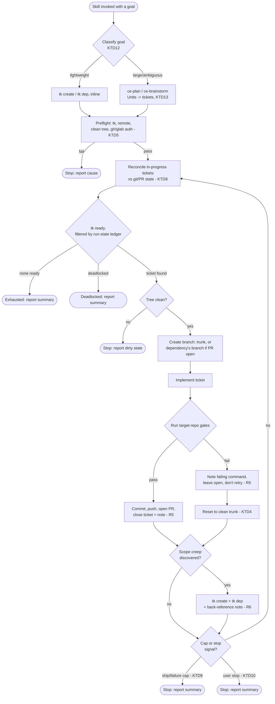
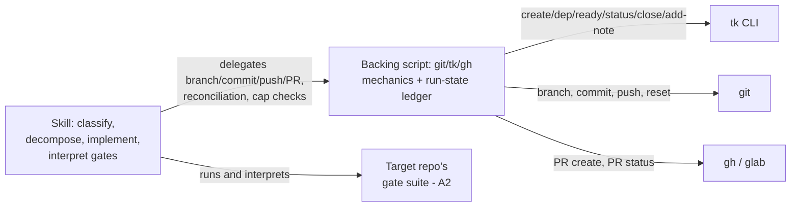

# Goal-to-Ticket Loop - Plan

<a id="goal-capsule"></a>
## Goal Capsule

- **Objective:** A user can hand a goal to an agent-extentions plugin and have it land as merge-ready pull requests, without babysitting each individual change — the goal is decomposed into tracked, dependency-ordered units of work and driven to completion unattended.
- **Means:** Tiered `tk` ticket-graph decomposition (inline, or `ce-plan`/`ce-brainstorm` escalation for large goals), then a script-backed, self-pacing execution loop implements, gates, branches/commits/pushes, and PRs each ready ticket (KTD1).
- **Authority hierarchy:** This plan is the product authority; no separate brainstorm document remains upstream of it.
- **Stop conditions:** Graph exhausted; remaining tickets deadlocked; ship-count or consecutive-failure cap reached (R9); user-invoked stop (R13).
- **Execution profile:** Autonomous, long-running, self-paces across turns/sessions (R7); runs against arbitrary target repos once installed (R10).
- **Tail ownership:** This plan's own implementation units ship through the implementer's normal flow (e.g. `ce-work`/`ce-commit-push-pr`) — the plugin cannot ship itself before it exists. Once built, the plugin owns its own shipping tail (commit, push, PR) for the target-repo tickets it processes.

---

<a id="product-contract"></a>
## Product Contract

<a id="summary"></a>
### Summary

This plan builds a standalone Claude Code plugin that takes a goal, decomposes it into a `tk` ticket graph — inline for lightweight goals, or via `ce-plan`/`ce-brainstorm` escalation for large ones — then runs a script-backed, self-pacing loop that implements, gates, commits, pushes, and PRs each ready ticket unattended until the graph is exhausted or a run cap is hit. Deterministic git/`tk`/`gh` operations run through a small Python backing script the skill invokes; run-scoped state (ship count, failure count, claimed tickets) persists to a durable per-run artifact so a long run survives context compaction.

<a id="problem-frame"></a>
### Problem Frame

Without this plugin, a user who hands an agent a multi-step goal must supervise each change — reviewing and confirming every commit — even when the work is well-specified enough to decompose and verify mechanically. That supervision cost is what stops a goal from being handed off entirely.

<a id="key-decisions"></a>
### Key Decisions

**Tiered decomposition, not a uniform approach.** (session-settled: user-directed — chosen over always-inline or always-ce-plan decomposition: mirrors `ce-work`'s existing Trivial/Small/Large routing rather than inventing new judgment logic.) Governs R1.

**The skill owns commit/push directly; it does not invoke `ship`.** (session-settled: user-directed — chosen over invoking `ship` as-is or adding an auto-confirm flag to it: keeps `ship`'s interactive per-commit confirmation untouched for its normal manual use, while letting this skill's ticket loop run fully unattended.) Governs R3, R4.

**A new standalone plugin, not a second skill inside `ship`.** (session-settled: user-approved — chosen over adding a skill to the existing `ship` plugin: ticket-graph decomposition and multi-ticket orchestration is a distinct concern from `ship`'s single-goal pipeline, and this repo's convention favors one plugin per coherent concern.)

**A self-pacing loop wrapper, not one long-running invocation.** (session-settled: user-approved — chosen over a single synchronous call that processes the whole graph: lets the run survive across a whole session instead of one bounded tool call, following the harness's own self-pacing `/loop` primitive rather than a bespoke mechanism.) Governs R7.

**Dependency-aware branch model.** A dependent ticket branches off its dependency's branch while that dependency's PR is still open; otherwise it branches off trunk. When a ticket has two or more predecessors with simultaneously open PRs (fan-in), it branches off trunk rather than picking one arbitrarily — git supports only one base per branch, and trunk is the only base every predecessor's eventual merge converges on. (session-settled: user-directed — chosen over holding dependents until merge (breaks the unattended-completion promise, since R8 forbids the loop from merging) or treating the `tk dep` edge as advisory only (makes it decorative): preserves trunk-off-default for the common case, while making dependency edges a real code relationship for the case where they matter.) Governs R4, R6.

<a id="requirements"></a>
### Requirements

**Product Contract preservation:** changed — R2, R4, R5, R6, R7, R9 are tightened or amended below (each note is inline); R11–R13 are new. R1, R3, R8, R10 are unchanged in meaning. Every change closes a gap the flow-analysis pass in this session found in the original text; none narrows product intent.

**Decomposition**

R1. Given a goal, the skill classifies its size/ambiguity and produces a `tk` ticket graph (tickets plus `tk dep` edges) sized to that classification: lightweight goals get inline decomposition (direct `tk create`/`tk dep` calls from a single reasoning pass); large or ambiguous goals escalate to `ce-plan`/`ce-brainstorm`, and the resulting Implementation Units become the ticket graph instead (KTD12 sizes the boundary, KTD13 maps Units to tickets).

R2. *(changed — tightened)* Every created ticket carries acceptance criteria specific enough for a later, context-free pass to implement and verify it; where the target repo's gate suite includes a test runner, those criteria are expressed as a test the implementation must make pass, so ticket completion is mechanically verifiable rather than only descriptive (KTD11).

**Execution loop**

R3. The skill repeatedly selects the highest-priority ready ticket not already claimed this run (`tk ready`, reconciled per KTD8), implements it, and runs the target repo's own gates — reading `CLAUDE.md`/`AGENTS.md` for defined gates, falling back to auto-discovery where silent (KTD3 restates the algorithm) — committing only when gates pass.

R4. *(changed — dependency-stacking exception added; see Key Decision above)* On a gate-passing implementation, the skill commits (Conventional Commits) on a fresh branch created before implementation began (KTD4), pushes the branch, and opens a pull request against the target repo's host — the branch bases off trunk by default, or off a still-open dependency's branch when this ticket depends on one — without invoking `ship`. Branch naming otherwise follows the pattern in KTD3.

R5. *(changed — note contents specified)* On success, the skill closes the ticket with a note recording the branch name, PR URL, and head commit SHA. On failure or block, it records the failing gate command and a redacted output excerpt (or block reason) plus the attempted approach, leaves the ticket open, and does not retry the same ticket again within the run — tracked via the run-state ledger (KTD2), since `tk ready` would otherwise resurface it.

R6. *(changed — back-reference added)* Work discovered mid-ticket that falls outside its scope is filed as a new ticket (`tk create`), with a `tk dep` edge when it blocks or depends on the ticket in progress, rather than expanding the current ticket's scope; the originating ticket gets a note referencing the new ticket so the relationship reads from either side.

R7. *(changed — terminal states enumerated)* The loop self-paces across turns, following the harness's own self-pacing `/loop` primitive, so it survives across a whole session rather than completing — or timing out — inside one bounded invocation. It continues until one of four terminal states is reached — graph exhausted, remaining tickets mutually deadlocked, a run cap hit (R9), or a user-invoked stop (R13) — then reports a summary classifying every ticket touched this run as shipped, failed/blocked, or not-reached.

**Safety & scope guardrails**

R8. The skill never autonomously merges or approves a pull request, force-pushes, deletes a branch it did not create, or takes a package-registry publish action.

R9. *(changed — reset semantics and cap scope specified)* The skill caps how many tickets it ships per run and how many consecutive failures (gate failures and blocks, counted together) it tolerates before stopping and reporting; a successful ship resets the consecutive-failure count to zero (KTD9). Caps are per-run and do not persist across separate invocations.

**Portability**

R10. The skill runs against whatever repo it's invoked in — it discovers gates and commit conventions from that repo's `CLAUDE.md`/`AGENTS.md` (or auto-discovery), never from agent-extentions' own conventions, since it is installed via the marketplace into other repos, not used only on itself.

**Preflight & resilience** *(new)*

R11. Before claiming any ticket, the skill verifies its preconditions — `tk` installed, the repo has a configured remote, the working tree is clean, and (only when PR creation will run) `gh`/`glab` is reachable and authenticated — and stops immediately with a clear report if any check fails, rather than spending the failure cap discovering it ticket by ticket. On a passing preflight, it reports the resolved target repo and trunk branch so the run is visibly on the intended repo before any ticket is claimed (KTD5).

R12. At the start of each run (fresh or resumed), before picking new work, the skill reconciles every in-progress ticket against local git and remote PR state — closing a ticket whose PR already merged externally, marking failed one whose PR was closed without merging, and recovering a ticket abandoned by a crashed prior run — before calling `tk ready` for new work (KTD8).

R13. The skill accepts a user-invoked stop request between tickets (never mid-ticket) and exits cleanly, reporting the partial-run summary per R7 (KTD10).

<a id="actors"></a>
### Actors

A1. **Invoking user** — states the goal, can interrupt or redirect at any point, and is never blocked on a per-commit confirmation once the execution loop starts (decomposition may still block on `ce-plan`/`ce-brainstorm`'s own questions, KTD7).

A2. **Target repo's gate suite** — the lint/type/test/build commands the target repo's `CLAUDE.md`/`AGENTS.md` defines (or, where silent, auto-discovery finds) — the sole arbiter of whether a ticket's implementation may be committed.

A3. **The skill and its backing script**, running under a self-pacing loop wrapper — the skill performs decomposition and implementation; the backing script (KTD1) performs deterministic git/`tk`/`gh` mechanics and the durable run-state ledger.

<a id="key-flows"></a>
### Key Flows

F1. **Trigger:** user invokes the skill with a goal.

Classify the goal's size/ambiguity → decompose into a ticket graph (inline, or via `ce-plan`/`ce-brainstorm` escalation) → preflight checks (R11) → self-pace: reconcile in-progress tickets against git/PR state (R12) → pick the highest-priority ready ticket not claimed this run → verify the tree is clean → implement it → run the target repo's gates → **on pass:** branch (trunk or stacked, R4), commit, push, open a PR, close the ticket with the linking note (R5) → **on fail/block:** note the reason, leave open, reset to a clean trunk (KTD4) → check for mid-ticket scope creep, file as a new ticket with a back-reference (R6) → check run caps and stop signal (R9, R13) → repeat until a terminal state is reached → stop and report a classified summary.

Covers R1, R3, R4, R5, R6, R7, R9, R11, R12, R13.

<a id="acceptance-examples"></a>
### Acceptance Examples

AE1. Given a small, concrete goal ("add input validation to the login form"), when the skill classifies it as lightweight, then it creates a small ticket graph directly via `tk create`/`tk dep` without invoking `ce-plan`. Covers R1.

AE2. Given a large or ambiguous goal ("redesign the notification system"), when the skill classifies it as needing planning rigor, then it escalates to `ce-plan`/`ce-brainstorm` and translates the resulting Implementation Units into the ticket graph. Covers R1.

AE3. Given a ticket whose implementation fails the target repo's gates, when the skill attempts it, then no commit is created, the ticket stays open with the failure reason noted, and the loop moves to the next ready ticket rather than retrying immediately. Covers R3, R5.

AE4. Given the run has shipped its configured ticket limit, when the next ticket would be picked up, then the loop stops and reports a summary distinguishing shipped, failed/blocked, and not-reached tickets instead of continuing. Covers R7, R9.

AE5. Given ticket B depends on ticket A whose PR is still open, when B becomes ready and is implemented, then B's branch is created off A's branch and B's PR targets A's branch as base, not trunk. Covers R4.

AE6. Given every remaining ready-eligible ticket is mutually blocked by unresolved dependencies with no forward progress possible, when the loop next checks for ready work, then it stops and reports "deadlocked" as the terminal state, distinct from "exhausted." Covers R7.

<a id="scope-boundaries"></a>
### Scope Boundaries

**Deferred for later:**
- GitHub/GitLab issue mirroring for created tickets — `tk`'s `--external-ref` field leaves room to bridge a ticket to an issue manually if wanted, but no automatic sync ships in v1.
- A dedicated "unsafe to ship" circuit breaker beyond the existing gate-failure path (R5) and safety guardrails (R8) — the existing failure-and-human-PR-review path is the v1 safety net.
- A bespoke stop/cancel companion command — the loop relies on the `/loop` wrapper's own interrupt mechanism instead (KTD10).

**Outside this plugin's identity:** PR auto-merge; package-registry publish actions of any kind; editing CI/workflow config without a ticket specifically scoped to that change; extending the existing `ship` plugin instead of shipping standalone (see Key Decisions).

<a id="dependencies-assumptions"></a>
### Dependencies / Assumptions

- Assumes `tk` (wedow/ticket) is installed in the environment the skill runs in; the skill does not install it.
- Assumes the target repo is a git repository with a configured remote and, when PR creation runs, a host reachable via `gh`/`glab`.
- Assumes the target repo's `CLAUDE.md`/`AGENTS.md` defines gates and commit style, or is silent and gate/style auto-discovery — restated from `ship`'s former pattern, KTD3 — applies instead.
- Assumes Python 3 is available in the environment to run the backing script, matching this repo's existing `yapermission`/`a2a` script convention.
- `compound-engineering` (`ce-plan`/`ce-brainstorm`) is a soft dependency for R1's escalation path; absence in the target repo degrades decomposition to inline-only, with the degradation noted in the run summary (KTD6) — a deliberate, documented exception to this repo's general cross-plugin self-containment convention, since escalation is this plugin's entire tiered-decomposition mechanism.
- Decomposition may block on `ce-plan`/`ce-brainstorm`'s own interactive questions for large/ambiguous goals; only the execution loop that follows is guaranteed unattended (KTD7).

---

<a id="planning-contract"></a>
## Planning Contract

### Key Technical Decisions

KTD1. **Backing script for deterministic operations.** (session-settled: user-directed — chosen over a pure-prompt skill like `ship`: makes safety-critical git/`tk`/`gh` operations directly testable and removes model-interpretation risk from operations that must be exact.) Implemented in Python, mirroring this repo's `yapermission`/`a2a` script-plus-`pytest` convention. Owns: dirty-tree checks, branch create/reset, run-state ledger read/write, `tk`/PR reconciliation queries, `gh`/`glab` PR create and status checks. The skill still runs and interprets the target repo's actual gate commands directly — the script does not wrap gate execution — so the gate run stays visible in the transcript. Gate-failure output written into a ticket note (R5) is redacted for common secret-shaped patterns (`KEY=value`-style env assignments, bearer/API-token-shaped strings) and capped in length before it's persisted, since target-repo gate failures routinely surface secrets in stack traces or env dumps. Governs R3, R4, R5, R9, R11, R12, R13.

KTD2. **Durable run-state ledger.** (session-settled: user-directed — chosen over in-context-only tracking: survives context compaction and crash/resume across a long self-pacing run.) A small JSON artifact in the target repo's working tree records tickets shipped this run, the consecutive-failure count, and the set of ticket IDs already claimed this run, keyed by a per-invocation run ID so two runs against the same repo (a resumed session, or a second concurrent invocation) never clobber each other's counters or claimed sets — this repo's own `yapermission` plugin needed exactly this fix twice (partition-per-session, then scope-to-calling-working-directory) after shipping a single shared cache file. The ledger's path is added to `.git/info/exclude` (git-native, per-repo, requires no cooperation from the target repo's own `.gitignore`) rather than relied on to already be ignored — the working-tree-clean checks in KTD5 explicitly exclude the ledger path, so writing it never trips the loop's own dirty-tree guard. `tk ready` lists both open and in-progress tickets, so this ledger — not `tk`'s own status field — is what stops the loop from re-picking a ticket it already processed this run. Governs R9, R12, R13.

KTD3. **Gate discovery and branch naming, restated.** Derived from research into the `ship` plugin's git history (removed from this repo's working tree this session; no cross-plugin reference to it survives). `CLAUDE.md`/`AGENTS.md`-declared gate commands are authoritative; absent that, probe in order: pre-commit config, Makefile/Justfile conventional targets, ecosystem-manifest scripts, CI workflow files as a last resort. No gate found is stated plainly ("no project gates detected") and treated as a pass — the ticket proceeds to commit — matching `ship`'s original behavior exactly; the loop never silently proceeds without stating it, and never invents a failure where none was configured. Branch name is `<type>/<slug>`, slugified from the ticket title, with a numeric collision suffix checked against local and `origin/` refs. Governs R3, R4.

KTD4. **Branch timing and abort cleanup.** A ticket's branch is created at claim time, before implementation starts — not right before commit, as `ship` did — so a crash mid-implementation never leaves work sitting on trunk. On any abort (gate failure or interruption), the backing script resets the working tree to a clean trunk (or the stacked-parent branch, when applicable) before the loop claims its next ticket. Governs R4, R5.

KTD5. **Preflight preconditions.** Before the first ticket claim, the skill verifies: `tk` is present, the repo has a configured remote, the working tree is clean, and — only when PR creation will run — `gh`/`glab` is reachable and authenticated. The preflight report names the resolved remote URL and trunk branch so a human watching the run notices immediately if it targets the wrong repo — a non-blocking disclosure, not a confirmation gate, since blocking would defeat R7's unattended, multi-session design. A failure here stops the run immediately with a named cause and is not counted against R9's failure cap. As defense in depth beyond KTD4's post-ticket reset, the working-tree-clean check (excluding the run-state ledger's own path, KTD2) repeats before each subsequent claim; a dirty tree found there stops the run rather than guessing at whose changes they are. Because a run can span hours across R7's self-pacing turns, `gh`/`glab` reachability and auth are re-verified as part of every KTD8 reconciliation pass, not only here — a token that expires mid-run is caught before it burns the failure cap on repeated PR-creation attempts. Governs R11.

KTD6. **`compound-engineering` as a soft dependency.** The skill checks for `ce-plan`/`ce-brainstorm` availability before routing a large/ambiguous goal to them; when absent, decomposition falls back to inline `tk create`/`tk dep` even for large goals, and the run summary notes the degradation. Governs R1, R10.

KTD7. **Decomposition may be interactive.** `ce-plan`/`ce-brainstorm` escalation may block on their own questions when decomposing a large/ambiguous goal; the "never blocked" guarantee (A1) scopes to the execution loop, which begins only after decomposition completes. Recorded as an explicit assumption, not a new mechanism. Governs R1.

KTD8. **Loop-start reconciliation.** Before every `tk ready` pick (fresh or resumed run), the backing script cross-checks each ledger-tracked in-progress ticket against local git and the target host's PR state: a merged PR closes the ticket with a note; a closed-without-merge PR marks it failed, left open; a pushed branch with no PR yet (a prior PR-creation failure) stays in-progress, re-verifies `gh`/`glab` auth (KTD5), and retries PR creation against the existing branch rather than re-implementing — a ticket whose PR creation keeps failing on the same credential routes to a preflight-class stop instead of retrying unboundedly. If the ledger itself is missing, malformed, or its claimed set can't be trusted, the pass falls back to cross-checking `tk`'s own in-progress tickets directly against git and PR state, rather than treating an empty or unreadable ledger as "nothing to reconcile." For a stacked ticket (branched off a still-open dependency's branch, per the dependency-aware branch model), the pass also re-checks whether that inherited base's PR has since merged or closed — a merged base means the dependent's next commit and PR should retarget trunk; a closed-unmerged base means the dependent is now built on abandoned work and is marked blocked, left open, with a note explaining why. Governs R3, R5, R12.

KTD9. **Failure-cap semantics and defaults.** R9's consecutive-failure counter increments on both a gate failure and a block, and resets to zero on any successful ship. v1 caps are fixed, not user-configurable: 10 tickets shipped per run, 3 consecutive failures; neither persists across separate invocations. Governs R9.

KTD10. **Self-pacing invocation model and stop mechanism reuse.** The skill is designed to be invoked repeatedly under the harness's self-pacing `/loop` mechanism (or an equivalent wrapper) rather than as one long-running call; each invocation re-enters by reading the run-state ledger (KTD2) and reconciling (KTD8) rather than assuming continuous in-context memory survives across turns. No bespoke stop/cancel command ships with the plugin; the loop relies on that same `/loop` wrapper's own interrupt mechanism and checks for it only between tickets, never mid-ticket, so an interruption always leaves a clean state for the next reconciliation pass. Governs R7, R13.

KTD11. **Acceptance-criteria binding.** Where the target repo's gate suite includes a test runner, a ticket's acceptance criteria are authored as a specific failing test (or enumerated test scenarios) the implementation must make pass; where no test gate exists, criteria remain a checklist the implementer verifies manually as part of gate-passing. Governs R2.

KTD12. **Decomposition size heuristic.** A goal stays lightweight (inline decomposition) when it has one well-defined outcome, no unresolved product ambiguity, and decomposes into roughly five or fewer tickets; it escalates to `ce-plan`/`ce-brainstorm` when it implies multiple independent workstreams, unclear product scope, or a ticket count that would clearly exceed that. Governs R1.

KTD13. **Unit-to-ticket mapping.** A `ce-plan` Implementation Unit maps one-to-one to a ticket by default, carrying the U-ID as the ticket's `--external-ref` for traceability; a Unit is split into multiple tickets only when its own file list spans clearly independent concerns. Governs R1, R2.

### High-Level Technical Design



The skill and the backing script (KTD1) split responsibility along a judgment/mechanism line: the skill classifies, decomposes, implements ticket content, and interprets gate output; the script performs every deterministic git/`tk`/`gh` operation and owns the run-state ledger (KTD2) that the reconciliation and cap logic reads and writes.



### Output Structure

```
plugins/goal-to-ticket-loop/
├── .claude-plugin/
│   └── plugin.json
├── README.md
├── skills/
│   └── goal-to-ticket-loop/
│       ├── SKILL.md
│       └── references/
│           ├── decomposition.md
│           ├── gate-discovery.md
│           ├── execution-loop.md
│           └── run-state-schema.md
├── scripts/
│   └── loop_runner.py
└── tests/
    ├── test_run_state.py
    ├── test_preflight.py
    ├── test_branching.py
    └── test_reconciliation.py
```

U1 additionally modifies two files at the repo root, outside this tree: `.claude-plugin/marketplace.json` (plugin registration) and `README.md` (plugin table and install list).

---

<a id="implementation-units"></a>
## Implementation Units

### Phase A: Backing script and scaffold

#### U1. Plugin scaffold and marketplace registration

- **Goal:** Create the plugin skeleton and register it, matching this repo's existing plugin conventions.
- **Requirements:** R10; Dependencies/Assumptions.
- **Dependencies:** none.
- **Files:**
  - `plugins/goal-to-ticket-loop/.claude-plugin/plugin.json`
  - `plugins/goal-to-ticket-loop/README.md`
  - `plugins/goal-to-ticket-loop/skills/goal-to-ticket-loop/SKILL.md` (stub frontmatter + placeholder body; U5/U6 fill it in)
  - `.claude-plugin/marketplace.json`
  - `README.md`
- **Approach:**
  1. Mirror `plugins/agentic-doc/.claude-plugin/plugin.json` and `plugins/tdd/.claude-plugin/plugin.json` shape (`name`, `version: 0.1.0`, `description`, `author`).
  2. Single flagship skill, directory name matches plugin name (bare `name:` in SKILL.md frontmatter, per `docs/agents/skill-patterns.md`).
  3. Register in `marketplace.json` with the seven-field shape used by existing entries (`name`, `source`, `homepage`, `description`, `category: developer-tools`, `keywords`, `tags`); bump `metadata.version`.
  4. Add a row to root `README.md`'s plugin table and install-list, per `docs/agents/readme-template.md`.
- **Patterns to follow:** `plugins/tdd/`, `plugins/agentic-doc/` directory shape; `docs/agents/readme-template.md` for the plugin README structure.
- **Test scenarios:** Test expectation: none — scaffolding and registration, no independent behavior.
- **Verification:** `plugin.json` and `marketplace.json` are valid and complete per this repo's root `CLAUDE.md` validation checklist; README follows the template structure.

#### U2. Backing script: run-state ledger and preflight checks

- **Goal:** Implement the durable run-state ledger and the preflight precondition checks.
- **Requirements:** R9, R11, R12.
- **Dependencies:** U1.
- **Files:**
  - `plugins/goal-to-ticket-loop/scripts/loop_runner.py`
  - `plugins/goal-to-ticket-loop/skills/goal-to-ticket-loop/references/run-state-schema.md`
  - `plugins/goal-to-ticket-loop/tests/test_run_state.py`
  - `plugins/goal-to-ticket-loop/tests/test_preflight.py`
- **Approach:**
  1. Ledger schema (KTD2): tickets shipped, consecutive-failure count, claimed-this-run ticket IDs, fixed caps (KTD9) — keyed by a per-invocation run ID and scoped to the calling working directory.
  2. Preflight checks (KTD5): `tk` present, remote configured, clean working tree, `gh`/`glab` reachable and authenticated when PR creation will run; report the resolved remote URL and trunk branch on a pass.
  3. Ledger path added to `.git/info/exclude` at setup (KTD2); dirty-tree checks exclude the ledger's own path.
- **Patterns to follow:** `plugins/yapermission/`'s script-plus-`pytest` convention for structure and test style.
- **Test scenarios:**
  - Happy path: fresh run creates a new ledger with zero counters and an empty claimed set.
  - Happy path: resumed run reads an existing ledger and preserves its counts.
  - Edge case: consecutive-failure counter resets to zero after a recorded success.
  - Edge case: counter does not reset after a recorded block.
  - Edge case: two ledgers from different run IDs (or different working directories) against the same target repo never see or mutate each other's counters or claimed sets.
  - Edge case: writing the ledger does not trip the working-tree-clean check on the next claim.
  - Error path: dirty working tree at preflight refuses to start and reports which paths are dirty.
  - Error path: `gh`/`glab` unauthenticated when PR creation will run fails preflight with a named cause, before any ticket is claimed.
- **Verification:** `pytest plugins/goal-to-ticket-loop/tests/test_run_state.py plugins/goal-to-ticket-loop/tests/test_preflight.py` passes.

#### U3. Backing script: branch operations and dependency-aware branching

- **Goal:** Implement deterministic branch creation, commit/push, and abort cleanup, including the dependency-stacking exception.
- **Requirements:** R4, R5, R8.
- **Dependencies:** U2.
- **Files:**
  - `plugins/goal-to-ticket-loop/scripts/loop_runner.py` (extend)
  - `plugins/goal-to-ticket-loop/tests/test_branching.py`
- **Approach:**
  1. Branch naming and collision guard per KTD3.
  2. Branch base resolution: trunk by default; a dependency's branch when `tk dep` names exactly one predecessor whose PR is still open (checked via `gh`/`glab` PR state); trunk when two or more predecessors have simultaneously open PRs (fan-in) or when no predecessor has an open PR.
  3. Branch created at claim time, before implementation (KTD4); on abort, reset the working tree to a clean trunk (or stacked-parent branch).
  4. Every git/`gh`/`glab` operation this script exposes is additive-only (create branch, commit, push, open PR) — no merge, approve, force-push, arbitrary branch-delete, or package-publish code path exists anywhere in the script (R8).
- **Technical design:** Dependency-branch resolution reads the ticket's `tk dep` edges, looks up each predecessor's linked PR (from its closing note, R5), and checks PR state; exactly one "still open" predecessor selects that predecessor's branch as base; "merged," "no PR yet," or two-or-more simultaneously open predecessors select trunk. Directional guidance, not implementation-specification.
- **Test scenarios:**
  - Happy path: a ticket with no dependencies branches off trunk.
  - Happy path: a ticket depending on a ticket whose PR is still open branches off that ticket's branch; PR base is set to that branch.
  - Edge case: a ticket depending on a ticket whose PR already merged branches off trunk, not the stale branch.
  - Edge case: a ticket with two or more predecessors whose PRs are simultaneously open branches off trunk, not any single predecessor's branch.
  - Edge case: branch-name collision applies a numeric suffix.
  - Error path: a gate failure mid-implementation resets the working tree to a clean trunk before returning control.
  - Guardrail: the script's exposed operations contain no merge, approve, force-push, arbitrary branch-delete, or publish code path — asserted directly against the script's public functions, not just its documented behavior. Covers R8.
- **Verification:** `pytest plugins/goal-to-ticket-loop/tests/test_branching.py` passes.

#### U4. Backing script: loop-start reconciliation

- **Goal:** Implement the reconciliation pass that cross-checks in-progress tickets against git and PR state at the start of every run.
- **Requirements:** R5, R12.
- **Dependencies:** U2, U3.
- **Files:**
  - `plugins/goal-to-ticket-loop/scripts/loop_runner.py` (extend)
  - `plugins/goal-to-ticket-loop/tests/test_reconciliation.py`
- **Approach:** Implement the five outcomes from KTD8 — merged-PR close, closed-unmerged-PR fail, pushed-branch-no-PR retry (with `gh`/`glab` re-auth), missing/corrupted-ledger fallback to `tk`'s own in-progress list, and stale-inherited-base retarget-or-block — as one reconciliation pass run before every `tk ready` pick.
- **Test scenarios:**
  - Happy path: an in-progress ticket whose PR merged is closed with an external-merge note, not re-attempted.
  - Happy path: an in-progress ticket whose PR closed unmerged is marked failed, left open, with a note explaining why.
  - Edge case: an in-progress ticket with a pushed branch but no PR (a prior PR-creation failure) stays in-progress and retries PR creation against the existing branch rather than re-implementing.
  - Edge case: a fresh run with no prior in-progress tickets treats reconciliation as a no-op.
  - Edge case: a missing or malformed ledger falls back to reconciling against `tk`'s own in-progress tickets rather than treating the run as having nothing to reconcile.
  - Edge case: a stacked ticket whose inherited base merged since branching retargets to trunk on its next commit/PR; one whose inherited base closed unmerged is marked blocked, left open.
  - Error path: repeated PR-creation failure against the same expired credential routes to a preflight-class stop rather than retrying without limit.
  - Integration: a simulated crash-and-resume (killed after commit+push, before `tk close`) recovers cleanly without double-implementing the ticket or losing the pushed commit.
- **Verification:** `pytest plugins/goal-to-ticket-loop/tests/test_reconciliation.py` passes.

### Phase B: Skill authoring

#### U5. Skill: decomposition

- **Goal:** Author the decomposition process — size/ambiguity classification, inline `tk create`/`tk dep` for lightweight goals, `ce-plan`/`ce-brainstorm` escalation with Unit-to-ticket translation for large goals, and test-bound acceptance criteria.
- **Requirements:** R1, R2.
- **Dependencies:** U1.
- **Files:**
  - `plugins/goal-to-ticket-loop/skills/goal-to-ticket-loop/SKILL.md` (decomposition section)
  - `plugins/goal-to-ticket-loop/skills/goal-to-ticket-loop/references/decomposition.md`
- **Approach:**
  1. Size/ambiguity classification per KTD12.
  2. Inline path: direct `tk create`/`tk dep` calls from a single reasoning pass.
  3. Escalation path: invoke `ce-plan`/`ce-brainstorm` (checking availability first, KTD6), translate Implementation Units to tickets one-to-one by default (KTD13).
  4. Acceptance-criteria authoring per KTD11 (test-bound when a test gate exists).
- **Patterns to follow:** `ce-work`'s Trivial/Small/Large routing table, for the shape of a size-classification decision (not its exact thresholds).
- **Execution note:** This unit is prompt-authored judgment, not deterministic logic — no backing script involvement.
- **Test scenarios:** Scenario-based, verified via the fixture-repo walkthrough in the Verification Contract (not unit tests — decomposition judgment isn't scriptable):
  - Happy path: goal "add input validation to the login form" decomposes inline, no `ce-plan` invocation. Covers AE1.
  - Happy path: goal "redesign the notification system" escalates to `ce-plan`/`ce-brainstorm`, Implementation Units become tickets. Covers AE2.
  - Edge case: target repo lacks `compound-engineering` installed — escalation degrades to inline decomposition, degradation noted (KTD6).
  - Edge case: target repo's gates include a test runner — a created ticket's acceptance criteria are a specific failing test, not just prose (KTD11).
- **Verification:** Fixture-repo walkthrough exercises AE1, AE2, and both edge cases above with the documented outcome.

#### U6. Skill: execution loop orchestration

- **Goal:** Author the execution-loop process — preflight, reconciliation, ticket pick, implementation, gate run, branch/commit/push/PR/close-or-note, scope-creep handling, cap and stop checks, and the classified terminal summary.
- **Requirements:** R3, R6, R7, R9, R13.
- **Dependencies:** U2, U3, U4, U5.
- **Files:**
  - `plugins/goal-to-ticket-loop/skills/goal-to-ticket-loop/SKILL.md` (execution-loop section)
  - `plugins/goal-to-ticket-loop/skills/goal-to-ticket-loop/references/execution-loop.md`
  - `plugins/goal-to-ticket-loop/skills/goal-to-ticket-loop/references/gate-discovery.md`
- **Approach:**
  1. `gate-discovery.md` restates the algorithm from KTD3 (extracted from `ship`'s removed git history) as this plugin's own reference — no cross-plugin pointer.
  2. Loop protocol follows the High-Level Technical Design flowchart: preflight → reconcile → pick (filtered by ledger) → dirty check → branch → implement → gate → ship-or-note → scope check → cap/stop check → repeat.
  3. Terminal summary (R7) classifies every ticket touched this run.
- **Patterns to follow:** The recovered `ship` gate-discovery and failure-reporting policy (verbatim failing-command output, never silent on "no gates found").
- **Test scenarios:** Scenario-based, verified via the fixture-repo walkthrough:
  - Happy path: a ready ticket is implemented, gates pass, PR opens, ticket closes with the full note (branch, PR URL, head SHA).
  - Happy path: a mid-ticket discovery creates a new ticket with a dependency edge and a back-reference note on the originating ticket; the loop continues. Covers R6.
  - Edge case: a gate failure leaves the ticket open with the failing-command note; the loop moves to the next ready ticket without retrying it this run. Covers AE3.
  - Edge case: all remaining tickets are mutually blocked; the loop reports "deadlocked," distinct from "exhausted." Covers AE6.
  - Edge case: the ship cap is reached mid-graph; the loop stops and the summary distinguishes shipped, failed/blocked, and not-reached (including untouched scope-creep tickets). Covers AE4.
  - Edge case: a dependent ticket whose predecessor's PR is still open branches off that predecessor's branch, not trunk. Covers AE5.
  - Edge case: a user stop signal observed between tickets exits cleanly with no half-gated commit. Covers R13.
- **Verification:** Fixture-repo walkthrough exercises AE3–AE6 and the scope-creep and stop scenarios above with the documented outcome.

---

<a id="verification-contract"></a>
## Verification Contract

- `pytest plugins/goal-to-ticket-loop/tests/` — backing script unit tests (U2–U4); the sole mechanically-gated verification track.
- Fixture-repo scenario walkthrough — a disposable git repo created under a scratch directory (never committed to this repo), with a minimal `CLAUDE.md`-declared gate suite standing in for the "target repo's own gates" (A2), used to exercise AE1–AE6 and the additional scenarios listed under U5 and U6. Decomposition and execution-loop judgment are prompt-authored, not scriptable, so this walkthrough — not a unit test — is their verification track (KTD1's scope boundary).
- Plugin structure and registration validated against this repo's root `CLAUDE.md` checklist (or the `plugin-dev:plugin-validator` agent, when available) — `plugin.json` required fields, `marketplace.json` registration, README structure.

<a id="definition-of-done"></a>
## Definition of Done

- All six implementation units complete; `pytest plugins/goal-to-ticket-loop/tests/` is green.
- The fixture-repo walkthrough exercises AE1–AE6 plus the reconciliation, scope-creep, deadlock, and stop scenarios, with the loop behaving as specified in each.
- `plugin.json` and `marketplace.json` pass the validation checklist; root `README.md` lists the plugin.
- No dead-end or experimental code remains from approaches that didn't pan out.

---

<a id="sources-research"></a>
## Sources / Research

- `ship` plugin's gate-discovery algorithm, branch-naming pattern, and commit-style convention — extracted via `git show HEAD:plugins/ship/skills/ship/SKILL.md` and `git show HEAD:plugins/ship/skills/ship/references/gates.md` before the plugin was removed from this repo's working tree this session; restated in this plugin's own `references/gate-discovery.md`, since no cross-plugin reference is possible once `ship` is gone.
- `docs/agents/skill-patterns.md`, `docs/agents/progressive-disclosure.md`, `docs/agents/readme-template.md` — this repo's own skill/plugin-authoring conventions.
- `plugins/yapermission/tests/`, `plugins/a2a/tests/` — this repo's existing script-plus-`pytest` testing convention, followed for the new plugin's backing script (KTD1).
- `tk --help` (installed locally) — grounds the ticket CLI's exact command surface (`create`/`dep`/`ready`/`start`/`close`/`reopen`/`status`/`show`/`add-note`/`query`); `ready` lists both open and in-progress tickets with resolved dependencies, which is why a separate run-state ledger — not `tk` status alone — tracks claimed-this-run tickets (KTD2, KTD8).
- Flow-analysis pass (this session) — surfaced the dependency/branch/merge conflict behind the Key Decision governing R4/R6, and the execution-lifecycle gaps behind R11–R13.
- The "prior single-repo `tk` + self-pacing-loop instance" this plan's earlier draft cited as precedent is unverified: two research passes in this session found no corroborating artifact — no ticket store, branch, commit, or document — anywhere in this repo's git history or working tree. Treated as design inspiration only, not a readable source.
